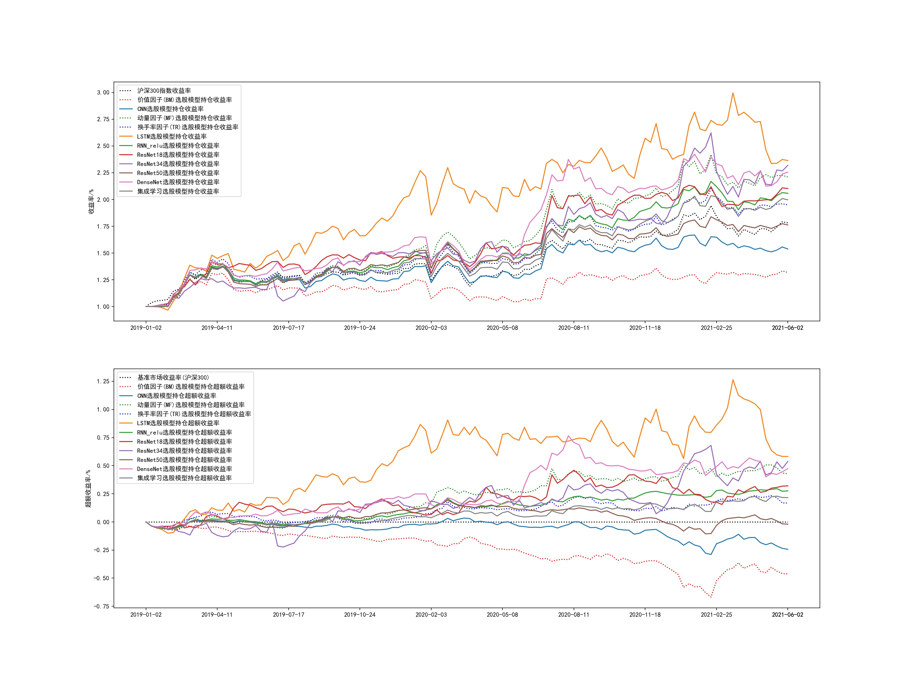
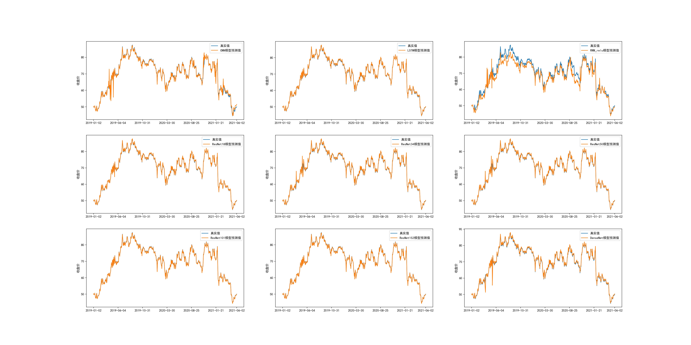

# stock-prediction-with-DL/深度学习与股票分析预测

先开一个坑，慢慢做

## data_downloader.py

通过baostock下载上证50，沪深300，中证500的日线数据

## backtest.py

回测模块，根据调仓周期，通过模型选股，按开盘价买入卖出（暂定），计算收益，与指数比较并绘图

当前回测结果：

## strategy.py

按价值因子（选择账面市值比BM）进行选股（效果差，由于BM在大市值公司的效果不佳）

用CNN预测模型进行选股

用动量因子(MF)进行选股

用换手率因子(TR)进行选股(思路参考自Liu et al.(2019) Size and value in China, 修改了数据选取)

用LSTM与reluRNN预测模型进行选股

用GRU与tanhRNN预测模型进行选股(效果不佳已放弃)

用ResNet18,34,50预测模型进行选股

用DenseNet预测模型进行选股

用综合几种网络预测结果的集成学习策略进行选股

其余策略待更新

## prediction.py

使用CNN对股票数据进行预测

使用LSTM与reluRNN对股票数据进行预测(GRU与tanhRNN由于效果不佳放弃)

使用ResNet18,34,50对股票数据进行预测(101与152由于效果不佳放弃)

使用DenseNet对股票数据进行预测

当前预测结果

sh.600000,浦发银行

sh.600004,白云机场

sh.600009,上海机场

sh.600010,包钢股份

sh.600011,华能国际

## tushare_apikey.txt

本地保存tushare pro的apikey

## /data/hs300_stocks.csv

存放指数股票列表数据

## /data/stocks/sh.000300.csv

存放指数日线数据

## /data/stocks/*.csv

存放回测个股日线数据

## /data/train_data/*.csv

存放训练集个股日线数据

## /data/*.pkl

存放训练集数据

## /data/*.pt

存放训练完成的模型数据

## result.jpg

回测结果展示图片

## *_predict.jpg

单只股票预测结果展示图片
